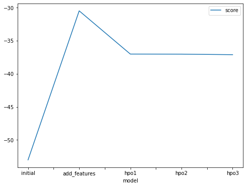

# Report: Predict Bike Sharing Demand with AutoGluon Solution
#### Anna Zemlyanova

## Initial Training
### What did you realize when you tried to submit your predictions? What changes were needed to the output of the predictor to submit your results?
The template asked us to delete all the negative entries since there cannot be negative demand for bikes. In my case, I didnot have negative entries. Additionally, since the training was based on a regression model, the output results where floating point, not integers.

### What was the top ranked model that performed?
The top ranked problem was the model with hyperparameters tuned. I changed number of epochs, number of leaves, and number of trials for the hyperparameters of TabularPredictor.

## Exploratory data analysis and feature creation
### What did the exploratory analysis find and how did you add additional features?
The exploratory analysis found that we have timedate variable, season, and weather variables, treated initially as integers. It was more meningful to separate the timedate onto month, day, and hour. Since season is not an ordered variable (winter is not less than spring) it makes sense to treat it as categorical. The same goes for the weather variable.

### How much better did your model preform after adding additional features and why do you think that is?
Both scores kaggle and the model training scores decreased significantly. This due to inclusion of additional features. Datestamp is mostly useless variable if not separated on month, date, and hour. At the same time, bike demand probably signifcantly depends on a month and a time of a day. Season should be treated as a categorical variable and separated into dummy variables since it is not ordered.

## Hyper parameter tuning
### How much better did your model preform after trying different hyper parameters?
It seems like tweaking learning rate, number of epochs, and number of leaves improved the model approximately 23% by kaggle score.

### If you were given more time with this dataset, where do you think you would spend more time?
It would make sense to work more with a datetime variable. Month, in general, should be treated as a categorical variable similarly to season. Similar thing can be doen for the hour. We could have also ran the model for a longer period of time. Unfortunately, in my case my kernel would interrupt if I tried to run it for longer periods, so I was only able to do time_limit=400. Nevertheless, the final score seemed to be satisfactory.

### Create a table with the models you ran, the hyperparameters modified, and the kaggle score.

|model|num_epochs|learning_rate|num_leaves|score|
|--|--|--|--|--|
|initial|10|5e-4|36|1.79388|
|add_features|10|5e-4|36|0.63596|
|hpo1|12|5e-4|50|0.48958|
|hpo2|20|5e-4|50|0.49205|
|hpo3|20|5e-3|50|0.49215|

### Create a line plot showing the top model score for the three (or more) training runs during the project.

### Create a line plot showing the top kaggle score for the three (or more) prediction submissions during the project.

## Summary
We trained several models predicting bike demand based on weather and calendar data. It seems to be essential to treat certain features as categorical. Overall performance of the final model was satisfcatory, even though not as good as top kaggle submissions. 
